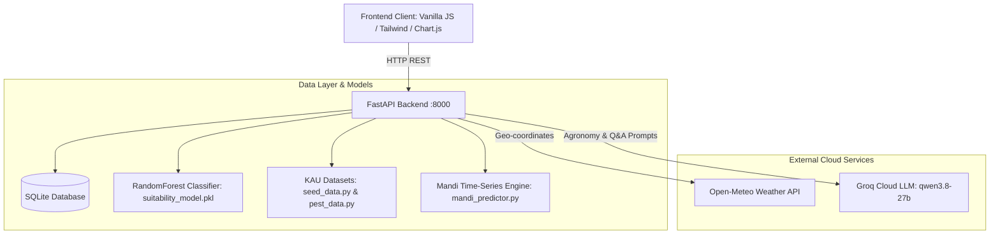

# FarmStart — API & Dataset Technical Specifications

This document provides complete, production-grade documentation of all **API endpoints**, **internal datasets**, and **external data integrations** within the FarmStart agricultural advisory platform.

---

## Table of Contents
1. [System Architecture Overview](#system-architecture-overview)
2. [All API Endpoints (15 Routes)](#all-api-endpoints-15-routes)
   - [Core Advisory & Feasibility](#1-core-advisory--feasibility)
   - [Conversational AI Copilot](#2-conversational-ai-copilot)
   - [Mandi Market Intelligence & Harvest Predictor](#3-mandi-market-intelligence--harvest-predictor)
   - [Integrated Pest & Disease Advisory](#4-integrated-pest--disease-advisory)
   - [Machine Learning Suitability & Agronomy](#5-machine-learning-suitability--agronomy)
   - [Government Subsidies & Regional Metadata](#6-government-subsidies--regional-metadata)
3. [Curated Agricultural Datasets (8 Datasets)](#curated-agricultural-datasets-8-datasets)
4. [External Live APIs](#external-live-apis)

---

## System Architecture Overview



---

## All API Endpoints (15 Routes)

### 1. Core Advisory & Feasibility

#### `POST /full-advisory`
* **Summary**: Unified advisory card generator. Aggregates ML suitability, live 7-day weather risk factors, Agmarknet seed benchmarks, and kicks off initial copilot advice.
* **Method**: `POST`
* **Query Parameters**:
  - `farmer_name` *(str, optional, default: `"Farmer"`)*
  - `district` *(str, required, e.g. `"Idukki"`)*
  - `crop` *(str, required, e.g. `"tomato"`)*
* **Sample Response (200 OK)**:
```json
{
  "success": true,
  "farmer": {
    "name": "Farmer",
    "district": "Idukki",
    "crop": "tomato"
  },
  "weather_advisory": {
    "is_safe_to_sow": true,
    "safety_status": "SAFE_TO_SOW",
    "recommended_window": {
      "season_name": "Second Crop (Mundakan)",
      "recommended_start": "September",
      "recommended_end": "October",
      "is_currently_in_window": true,
      "sowing_tips": "Ideal transplanting window following heavy monsoon recedes."
    },
    "forecast_summary": {
      "avg_temp_c": 23.5,
      "min_temp_c": 19.2,
      "max_temp_c": 27.8,
      "total_rainfall_next_7d_mm": 28.4,
      "rain_probability_pct": 35,
      "humidity_avg_pct": 78.0,
      "weather_condition": "Partly cloudy",
      "is_live_data": true
    },
    "risk_factors": [
      "Moderate humidity may encourage fungal blight on young seedlings."
    ],
    "advisory_notes": "Conditions in Idukki are currently favorable for tomato sowing."
  },
  "ml_suitability": {
    "crop": "tomato",
    "district": "Idukki",
    "suitability_category": "High",
    "suitability_score": 88.0,
    "confidence_pct": 91.2,
    "limiting_factors": [],
    "optimization_tips": ["Ensure raised nursery beds for effective drainage."]
  },
  "seed_price_benchmark": {
    "crop": "tomato",
    "range": "₹350 - ₹450 / 100g",
    "fair_price_per_unit": "₹400 / 100g",
    "min_price": 350.0,
    "max_price": 450.0,
    "unit": "100g",
    "source": "KSSDA / Agmarknet Certified"
  },
  "copilot_chat": {
    "farmer_name": "Farmer",
    "reply": "Hello Farmer! Based on current meteorological forecasts in Idukki, conditions are safe and favorable to sow tomato...",
    "actionable_tips": [
      "Prepare raised nursery beds of 15cm height to avoid standing water.",
      "Treat seeds with Trichoderma viride (4g/kg) before sowing.",
      "Check with your local Krishi Bhavan for vegetable seedling subsidies."
    ],
    "suggested_followups": [
      "What is the recommended nursery spacing?",
      "How to prevent bacterial wilt in tomato?"
    ]
  }
}
```

---

### 2. Conversational AI Copilot

#### `POST /advisory-chat`
* **Summary**: Conversational LLM copilot for farmer Q&A using Groq (`qwen/qwen3.8-27b` or `llama-3.3-70b-versatile`). Translates complex scientific data into empathetic, actionable advice in English or Malayalam.
* **Method**: `POST`
* **Request Body** (`application/json`):
```json
{
  "farmer_name": "Anil",
  "question": "if i want the tomatos at february when should i plant it",
  "conversation_history": [
    { "role": "user", "content": "Is it safe to plant now?" },
    { "role": "assistant", "content": "Yes, current weather is favorable." }
  ],
  "context": {
    "district": "Idukki",
    "crop": "tomato",
    "soil_type": "Hill soil",
    "suitability_score": 88.0,
    "suitability_category": "High",
    "is_safe_to_sow": true,
    "seed_price_range": "₹350 - ₹450 / 100g",
    "weather_forecast": "Moderate rain, 23.5°C"
  }
}
```
* **Sample Response (200 OK)**:
```json
{
  "success": true,
  "farmer_name": "Anil",
  "reply": "To harvest fresh tomatoes in February, start seedlings in a nursery between late October and early November. Since tomatoes take roughly 75 to 90 days from field transplanting to maturity, transplanting 25-day-old seedlings in mid-November ensures your primary yield peaks across February.",
  "actionable_tips": [
    "Sow nursery trays under a poly-mesh in late October to shield emerging sprouts.",
    "Transplant seedlings into well-drained hill soil ridges with 60cm x 45cm spacing.",
    "Procure certified bacterial-wilt resistant varieties like KAU Anagha or Mukthi."
  ],
  "suggested_followups": [
    "What fertilizer schedule should I follow during flowering?",
    "Where is the nearest Krishi Bhavan in Idukki?"
  ]
}
```

---

### 3. Mandi Market Intelligence & Harvest Predictor

#### `GET /harvest-price-predictor`
* **Summary**: 30-day wholesale mandi price trajectory (15-day historical + 14-day projection), APMC comparative market heatmap across Kerala, and cold storage vs. fresh sell economic intelligence.
* **Method**: `GET`
* **Query Parameters**:
  - `crop` *(str, optional, default: `"tomato"`)*
  - `district` *(str, optional, default: `"Idukki"`)*
* **Sample Response (200 OK)**:
```json
{
  "crop": "tomato",
  "district": "Idukki",
  "baseline_current_price": 28.5,
  "predicted_14d_price": 34.2,
  "pct_change_14d": 20.0,
  "trend_direction": "UPWARD",
  "confidence_score": 88.5,
  "market_sentiment": "Bullish (Upcoming Festival Demand & Lower Inflow)",
  "trajectory_30d": [
    { "day_index": -15, "date": "2026-09-01", "date_label": "Sep 01", "price_per_kg": 24.2, "is_projected": false },
    { "day_index": 0, "date": "2026-09-16", "date_label": "Today", "price_per_kg": 28.5, "is_projected": false },
    { "day_index": 14, "date": "2026-09-30", "date_label": "Sep 30", "price_per_kg": 34.2, "is_projected": true }
  ],
  "mandi_heatmap": [
    { "mandi_name": "Vengeri Wholesale Market, Kozhikode", "district": "Kozhikode", "price_per_kg": 32.0, "price_diff_vs_local": 3.5, "is_local_district": false },
    { "mandi_name": "Adimali APMC Sub-Yard, Idukki", "district": "Idukki", "price_per_kg": 28.5, "price_diff_vs_local": 0.0, "is_local_district": true }
  ],
  "storage_recommendation": {
    "action": "HOLD IN COLD STORAGE",
    "urgency": "MODERATE",
    "projected_profit_per_quintal": 570.0,
    "storage_cost_per_quintal_month": 120.0,
    "spoilage_risk": "Low (Under 10°C / 90% RH)",
    "recommendation_summary": "Net gain of +₹450/quintal after storage costs by selling in 14 days."
  }
}
```

#### `GET /seed-prices`
* **Summary**: Returns certified retail seed price range and unit benchmarks from KSSDA & Agmarknet for any crop.
* **Method**: `GET`
* **Query Parameters**:
  - `crop` *(str, optional, default: `"all"`)*
* **Sample Response (200 OK)**:
```json
{
  "crop": "tomato",
  "variety": "Akshaya / Anagha (KAU)",
  "range": "₹350 - ₹450 / 100g",
  "min_price": 350.0,
  "max_price": 450.0,
  "fair_price_per_unit": "₹400 / 100g",
  "unit": "100g",
  "source": "KSSDA / Agmarknet Certified"
}
```

#### `GET /live-market-prices`
* **Summary**: Live wholesale market prices from APMC mandis across Kerala.
* **Method**: `GET`
* **Query Parameters**:
  - `crop` *(str, optional)*

---

### 4. Integrated Pest & Disease Advisory

#### `GET /pest-advisory`
* **Summary**: Retrieves diagnostic symptoms, threat severity, bio-control recipes (e.g. Neem-Garlic emulsion, Pseudomonas fluorescens), and cultural prevention rules from KAU Package of Practices.
* **Method**: `GET`
* **Query Parameters**:
  - `crop` *(str, required, e.g. `"tomato"`)*
  - `district` *(str, optional, default: `"Idukki"`)*
* **Sample Response (200 OK)**:
```json
{
  "crop": "tomato",
  "district": "Idukki",
  "total_pests": 3,
  "pests": [
    {
      "pest_id": "tomato_fruit_borer",
      "name": "Tomato Fruit Borer",
      "scientific_name": "Helicoverpa armigera",
      "type": "Insect Pest (Lepidoptera)",
      "severity": "HIGH",
      "symptoms": "Circular boreholes in green and ripening tomatoes with frass accumulation; flowers drop early.",
      "organic_biocontrol": {
        "title": "Neem Oil & Garlic Emulsion (KAU Standard)",
        "ingredients": "50ml Neem oil + 20g crushed garlic extract + 10g bar soap in 1 liter water",
        "preparation": "Dissolve soap in warm water, add garlic juice and neem oil, shake vigorously until creamy milk forms.",
        "application_rate": "Spray 20ml/liter water on foliage underside in late afternoon."
      },
      "chemical_fallback": "Spinosad 45% SC @ 0.3ml/liter or Chlorantraniliprole 18.5% SC @ 0.3ml/liter (Waiting period: 3 days).",
      "prevention": "Set up 4-5 pheromone traps per acre; plant marigold (African tall) as trap crop."
    }
  ]
}
```

---

### 5. Machine Learning Suitability & Agronomy

#### `POST /predict-suitability`
* **Summary**: Executes scikit-learn Random Forest model inference (`suitability_model.pkl`) to evaluate crop feasibility against 10 agronomic parameters.
* **Method**: `POST`
* **Request Body** (`application/json`):
```json
{
  "crop": "tomato",
  "district": "Idukki",
  "soil_type": "Hill soil",
  "nitrogen": 75.0,
  "phosphorus": 42.0,
  "potassium": 58.0,
  "ph": 5.8,
  "temperature": 23.5,
  "humidity": 78.0,
  "rainfall": 150.0
}
```
* **Sample Response (200 OK)**:
```json
{
  "crop": "tomato",
  "district": "Idukki",
  "suitability_category": "High",
  "suitability_score": 88.0,
  "confidence_pct": 91.2,
  "limiting_factors": [
    "Soil pH (5.8) is slightly acidic; apply 200g dolomite or lime per square meter."
  ],
  "optimization_tips": [
    "Boost potassium application during fruit set to enhance tomato firmness."
  ]
}
```

#### `GET /crop-fit`
* **Summary**: Returns ranked lists of high, medium, and moderate suitability crops tailored specifically to a district's agro-climatic zone.
* **Method**: `GET`
* **Query Parameters**:
  - `district` *(str, required, e.g. `"Idukki"`)*

#### `POST /weather-advisory`
* **Summary**: Connects to Open-Meteo API for 7-day live forecasts, parses temperature/rainfall risk thresholds, and returns safety recommendations.
* **Method**: `POST`
* **Request Body** (`application/json`):
```json
{
  "crop": "tomato",
  "district": "Idukki",
  "lat": 9.8494,
  "lon": 76.9814
}
```

#### `POST /evaluate-sowing-window`
* **Summary**: Validates if the current date aligns with KAU recommended agricultural seasons (Virippu, Mundakan, Puncha).
* **Method**: `POST`
* **Request Body** (`application/json`):
```json
{
  "crop": "tomato",
  "sowing_date": "2026-09-16"
}
```

---

### 6. Government Subsidies & Regional Metadata

#### `GET /government-schemes`
* **Summary**: Returns active Central and Kerala State Government subsidy and assistance schemes.
* **Method**: `GET`
* **Query Parameters**:
  - `crop` *(str, optional)*
* **Sample Response (200 OK)**:
```json
{
  "crop": "tomato",
  "count": 3,
  "schemes": [
    {
      "id": "subhiksha_keralam",
      "title": "Subhiksha Keralam Integrated Vegetable Development",
      "department": "Department of Agriculture Development and Farmers' Welfare, Kerala",
      "benefits": "₹30,000/ha subsidy for commercial vegetable cultivation; subsidized certified seeds.",
      "eligibility": "Individual farmers, SHGs, Kudumbashree groups with minimum 10 cents land.",
      "application_mode": "Online via AIMS Portal or Krishi Bhavan",
      "documentation": "Aadhaar Card, Land Tax Receipt, Bank Passbook"
    }
  ]
}
```

#### `GET /districts`
* **Summary**: Returns all 14 Kerala districts with geographic coordinates, soil classifications, and climate zones.
* **Method**: `GET`

#### `GET /crops`
* **Summary**: Returns the full catalog of crops with duration, ideal soil series, and recommended KAU varieties.
* **Method**: `GET`

#### `GET /` and `GET /health`
* **Summary**: Root status and diagnostic ping reporting FastAPI state, version, and database connectivity.
* **Method**: `GET`

---

## Curated Agricultural Datasets (8 Datasets)

| # | Dataset Name | Primary Source | File Location in Project | Description & Key Schema Fields |
|---|---|---|---|---|
| **1** | **Kerala Districts & Soil Baselines** | Kerala Agricultural University (KAU) & State Soil Health Cards | `backend/app/data/seed_data.py` (`KERALA_DISTRICTS`) | All 14 Kerala districts mapped with `primary_soil`, `soil_types[]`, `default_npk` (N, P, K, pH), `climate_zone`, `avg_annual_rainfall_mm`, `lat`, and `lon`. |
| **2** | **KAU Crop Agronomy Catalog** | KAU "Package of Practices: Crops" (Food Crops, Vegetables, Spices) | `backend/app/data/seed_data.py` (`CROPS_CATALOG`) | Covers tomato, rice, banana, cardamom, ginger, black pepper, cabbage, carrot, etc. Fields: `crop_id`, `name`, `category`, `ideal_soil_types[]`, `optimal_temp`, `optimal_rainfall`, `kau_varieties[]`, `duration_days`. |
| **3** | **Sowing Calendars & Cropping Seasons** | Department of Agriculture Development and Farmers' Welfare, Kerala | `backend/app/data/seed_data.py` (`SOWING_CALENDARS`) | Sowing windows by seasonal cycle (`Virippu`, `Mundakan`, `Puncha`, Summer). Fields: `season_name`, `start_month`, `end_month`, `sowing_tips`, `safe_windows`. |
| **4** | **Certified Seed Price Benchmarks** | Kerala State Seed Development Authority (KSSDA) & Agmarknet | `backend/app/data/seed_data.py` (`SEED_PRICES`) | Price baselines per retail packaging unit. Fields: `crop_id`, `variety`, `retail_price_min`, `retail_price_max`, `unit`, `subsidy_eligibility_pct`. |
| **5** | **KAU Pest & Bio-Control Formulations** | KAU Plant Protection Manual & KVK Integrated Pest Management (IPM) | `backend/app/data/pest_data.py` (`KAU_PEST_PROFILES`) | Diagnostic profiles for 11 major pests/diseases. Fields: `pest_id`, `name`, `scientific_name`, `type`, `severity`, `symptoms`, `organic_biocontrol` (ingredients, preparation, rate), `chemical_fallback`, `prevention`. |
| **6** | **Kerala APMC Mandi Network & Wholesale Pricing** | Agmarknet & Kerala State Agricultural Marketing Board | `backend/app/services/mandi_predictor.py` (`KERALA_MANDIS_NETWORK`) | Mandis across Vengeri (Kozhikode), Palakkad, Anayara (Trivandrum), Adimali (Idukki), Aluva (Ernakulam), etc. Fields: wholesale baseline, daily volatility index, transport surcharge, cold storage rate. |
| **7** | **Agricultural Schemes & Subsidies** | Krishi Bhavan Kerala, SHM, and Ministry of Agriculture | `backend/app/data/seed_data.py` (`GOVERNMENT_SCHEMES`) | Active verified schemes. Fields: `scheme_id`, `title`, `department`, `benefits`, `eligibility`, `application_mode`, `documentation`. |
| **8** | **Crop Suitability Machine Learning Training Dataset** | Synthesized from ICAR Crop Recommendation Benchmark + KAU Agronomic Bounds (4,000 samples) | `backend/app/data/ml_models/suitability_model.pkl` | 10 Input Features: `N`, `P`, `K`, `pH`, `temperature`, `humidity`, `rainfall`, `crop`, `district`, `soil_type`. Target: `suitability_category` (`High`, `Medium`, `Low`). |

---

## External Live APIs

### 1. Open-Meteo Numerical Weather API
* **Base URL**: `https://api.open-meteo.com/v1/forecast`
* **Method**: `GET`
* **Parameters**: `latitude`, `longitude`, `hourly=temperature_2m,relative_humidity_2m,precipitation_probability,rain`, `daily=weather_code,temperature_2m_max,temperature_2m_min,precipitation_sum`, `timezone=Asia/Kolkata`
* **Usage**: Provides live 7-day weather predictions per district coordinates. Determines real-time sowing safety, heavy rain alerts, and humidity-driven pathogen risk factors.
* **Resilience**: If the external service is unavailable or rate-limited, an automated fallback synthesizes seasonal climate averages based on the district's agro-climatic profile.

### 2. Groq Cloud Inference Engine
* **Base URL**: `https://api.groq.com/openai/v1/chat/completions`
* **Method**: `POST`
* **Model**: `qwen/qwen3.8-27b` (with fallback to `llama-3.3-70b-versatile`)
* **Headers**: `Authorization: Bearer ${GROQ_API_KEY}`
* **Response Format**: Strict JSON object (`{"type": "json_object"}`)
* **Usage**: Generates empathetic, contextual agronomic guidance in English and Malayalam based on soil, weather, mandi prices, and university guidelines.
